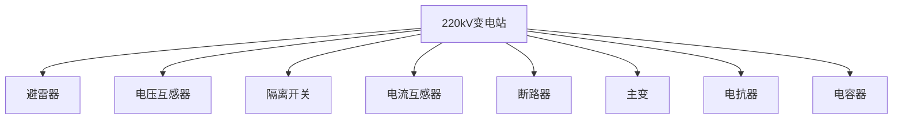
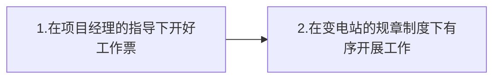

# Robot培训手册

:date:2022-04-18	:boy:Gui Hao

[TOC]

## 1. Robot硬件:robot:

### 1.1认识产品

[机器人产品培训手册](https://www.aliyundrive.com/s/zbHFrzXLX94)

### 1.2硬件手册

## 2. Robot软件:computer:

### 2.1 站端系统操作手册

[站端操作手册](https://www.aliyundrive.com/s/9G92Yf9Nzjp)

## 3. Robot运维:man_mechanic:

### 3.1 异常处理

[消缺手册](https://www.aliyundrive.com/s/GkFST1YUNAn)

## 4. 应用场景知识:⚡

### 4.1 变电站有哪些设备

参考PPT配合使用：[电力行业基础知识.ppt](https://www.aliyundrive.com/s/39vjbNGhmcA)

### 4.2 工作流程

剩余部分参考：[工作流程.xmind](https://www.aliyundrive.com/s/qBYruNEuBpN)

### 4.3 台账

>   什么是台账？
>
>   台账就是将变电站数字化，能够让Robot获取并解析，并按照其特定的方式去运转

参考此模板：[台账.ecxel](https://www.aliyundrive.com/s/RG3sgzo4m1f)

